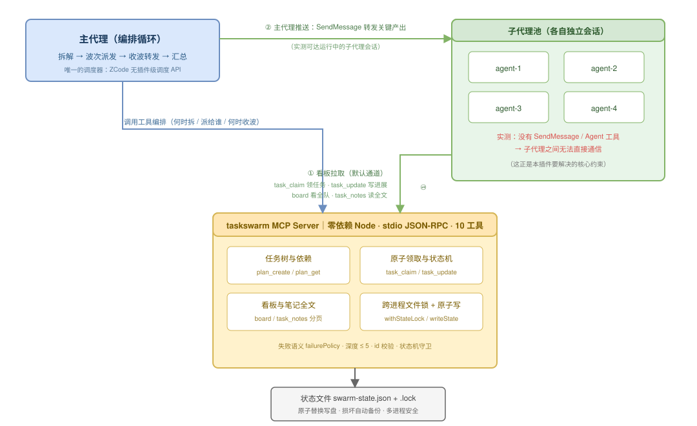

# TaskSwarm · 任务蜂群

> 多 Agent 编排引擎：把一个目标拆成任务树，按依赖波次并行派发子代理，用共享看板让互不可见的子代理"看见"彼此。**MCP 服务端零依赖、三平台共用**（ZCode / dsh / Codex CLI）。

[English](README.en.md) | 中文

[](#测试与可靠性)
[](#测试与可靠性)
[](#工程要点)
[](https://nodejs.org)

---

## 平台适配现状

**一份 `mcp/server.mjs`，三个宿主共用**——差异只在"谁派发子代理、子代理能不能说话"。

| | ZCode | dsh（DeepSeek Harness） | Codex CLI |
| --- | --- | --- | --- |
| MCP 挂载 | 插件自带（`.zcode-plugin/`） | `@deepseek-ai/dsh-mcp-client`（stdio） | `[mcp_servers.taskswarm]` |
| 工具前缀 | `mcp__plugin_taskswarm_taskswarm__*` | `mcp__taskswarm__*` | `mcp__taskswarm__*` |
| 派发子代理 | `Agent`（`run_in_background`） | `subagent`（`spawn`/`fork`） | `.codex/agents/*.toml` + `multi_agent` |
| 父→子推送 | `SendMessage`（仅运行中） | **`send_message`**（可续期） | ❌ 无 |
| 子→父回报 | ❌ 无 | **`report`** | ❌ 无 |
| 观察/干预 | ❌ 无 | **`list_agents` / `interrupt_agent`** | ❌ 无 |
| 适配成熟度 | **原生**（本插件诞生于此） | **MCP 链路已实测**（11 工具全通）；编排按原生工具映射 | MCP 挂载已确认；**子代理继承 MCP 工具随版本变化，需自行验证** |

**结论**：看板通道在所有宿主可用——这就是跨平台的意义。dsh 另有子代理 ↔ 父代理直连通道，
能力比 ZCode 版更强（看板从"唯一通道"降级为"公共黑板 + 持久化事实源"）。

> **验证边界（不夸大）**：三个宿主里，**只有 ZCode 是端到端跑过真实蜂群的**（本插件诞生于此，
> 123 个测试全部跑在该路径上）。dsh 验证到"MCP 链路 + 11 工具 + 依赖守卫"这一层（以
> `dsh-mcp-client` 相同的方式逐步驱动）；Codex 验证到"MCP 挂载成功"。**两边的"模型驱动完整蜂群"
> 都还没跑过**——测试当日所有可用中转 key 余额不足。Codex 另有一项版本相关风险：
> 子代理能否继承父会话的 MCP 工具随版本变化，需自行验证。详见各 `adapters/` 文档的实测记录表。

适配配置与实测记录见 [`adapters/dsh/`](adapters/dsh/README.md) 与 [`adapters/codex/`](adapters/codex/README.md)。

---

## 30 秒看懂

单个 AI 子代理能力很强，但**一次只能干一件线性的事**。面对"重构登录模块 + 补齐测试 + 更新文档"这种可并行的任务，只能串着做。

TaskSwarm 让主代理把目标拆成**任务树**，把互不依赖的部分**同时**派给多个后台子代理，再用一块共享看板让它们交换进度——最后主代理收波、转发关键产出、汇总。

```
一个目标  →  任务树（带依赖）  →  按波次并行派发  →  共享看板互通  →  汇总
```

## 核心设计洞察：子代理之间没有通信能力

这是本插件要解决的**根本约束**，也是它与"主代理随手开几个子代理"最大的不同。
（下述探测在 ZCode 上做的；dsh 的子代理体系更完整，见 [平台适配现状](#平台适配现状)。）

我在实现前先做了能力探测，实测结论：

| 能力 | 主代理 | 子代理 |
| --- | --- | --- |
| 启动子代理（`Agent`） | ✅ 有 | ❌ **没有** |
| 给别的代理发消息（`SendMessage`） | ✅ 有 | ❌ **没有** |
| 调用 MCP 工具 | ✅ 有 | ✅ **有** |

也就是说：**子代理是一群"哑"worker——干得了活，喊不了话，也生不出小代理。**

这个约束直接决定了两条通信通道：

1. **看板拉取（默认通道）**：子代理通过 MCP 主动读写共享看板。领任务用 `task_claim`、汇报进度用 `task_update`、了解全队状态用 `board`、读同伴的完整结论用 `task_notes`。因为是"拉取"，子代理永远不需要别人主动通知它。**看板可读也可写**——任何代理都能给任意任务卡留言（`task_update` 的 owner 校验只管状态变更），这是子代理之间真正的双向通道。
2. **主代理推送（补强通道）**：主代理是唯一有 `SendMessage` 的角色，因此它承担"信息搬运工"：派发新任务时把上游产出写进子代理 prompt；收到某子代理完成通知后，把关键结论转发给正在跑的、与之相关的其他子代理。**这条通道我做了实测**：给一个正在执行长任务的子代理推送带验证码的消息，它在中途收到了——推送通道可用，不是理论设计。



*（可编辑源文件：[`docs/architecture.drawio`](docs/architecture.drawio)）*

## 为什么不能直接用现成的

调研结论（2026-09）：**Claude Flow / Ruflo**（61k★）、**barkain/claude-code-workflow-orchestration**、**Agent Teams** 都是 Claude Code 专用，依赖 ZCode 没有的 `TaskCreate` / `TeamCreate` / hooks 实验机制，无法移植。

而 ZCode 这边：原生子代理**可以调用 MCP 工具**（已探针验证），但没有 SendMessage —— 所以互通必须设计成"看板拉取 + 主代理推送"双通道，而不可能靠代理间直连。

（dsh 的情况更好：它原生提供 `send_message` / `report` / `list_agents`，子代理与父代理可直连。
本插件的看板通道在这两个宿主都可用，dsh 上还能叠加直连通道。）

本插件的架构是 **「MCP 提供确定性能力 + SKILL.md 提供编排流程」**：

- **确定性部分全部下沉到 MCP Server**：任务树存储、依赖判定、防重复领取、并发写盘、看板渲染、笔记分页。这些是"有明确正确答案"的事，不该交给 LLM 每次自由发挥。
- **编排循环留给主代理**：何时拆解、拆多细、派给谁、何时收波、如何转发——这些需要判断力，ZCode 没有插件级调度 API 可挂，主代理本身就是调度器。

## 安装

需要 **Node.js ≥ 18**，零第三方依赖。

```bash
git clone https://github.com/Wersky/taskswarm.git
```

### ZCode

**设置 → 插件管理 → 发现 → 「+」添加本地目录市场**，指向包含 `marketplace.json` 的目录，安装 `taskswarm`，重启会话。

插件清单使用 `${ZCODE_PLUGIN_ROOT}` / `${ZCODE_PROJECT_DIR}` 占位符，**不硬编码任何本机绝对路径**——换台机器克隆下来即可运行。

### dsh（DeepSeek Harness）

把 [`adapters/dsh/cordis.patch.yml`](adapters/dsh/cordis.patch.yml) 的 `insert` 段加进你的
profile patch，改掉 `args` 里的路径：

```yaml
- insert:
    - id: mcp-taskswarm
      name: '@deepseek-ai/dsh-mcp-client'
      config:
        serverName: taskswarm
        transport: stdio
        command: node
        args: ['/你的路径/taskswarm/mcp/server.mjs']
```

```bash
dsh --profile <name> --dump-config | grep mcp-taskswarm   # 确认加载
```

### Codex CLI

```bash
codex mcp add taskswarm -- node /你的路径/taskswarm/mcp/server.mjs
codex mcp list
```

注意 Codex 0.154+ 的 provider 只支持 `wire_api = "responses"`。详见
[`adapters/codex/README.md`](adapters/codex/README.md)。

## 使用

```bash
/swarm 重构登录模块并补齐测试
```

或者直接说「任务蜂群：<任务>」「把任务拆解并行处理」。

主代理会展示拆解出的任务树，按依赖波次派发，过程中你可以随时看板：

```
[T1] (done)        抽出认证接口 @agent-1 💬 接口定稿在 src/auth/types.ts，前端可直接引用
[T2] (in_progress) 重写登录流程 @agent-2 💬 已接通新接口，正在补错误分支
[T3] (pending)     更新登录文档 ← 依赖: T1
```

### 什么时候**不该**用

- **< 3 个子项**：拆解开销大于并行收益，主代理直接做。
- **强串行依赖**：拆了也是一波一波等，没有并行度。
- **需要频繁来回讨论**：用圆桌讨论（[roundtable](https://github.com/Wersky/roundtable) 插件）更合适。
- **单纯查资料 / 读代码**：Explore 子代理更省。

### 一条硬规则：改同一批文件的子任务必须串行

并行最常见的翻车方式，是让两个子代理同时改同一个文件——后写的覆盖先写的，而且双方都以为自己成功了。**拆解时凡是要动同一批文件的任务，必须用 `dependsOn` 串起来。**

## PPR 审核门（2.1.0）

给任务配 `reviewer` 即启用审核门——**未过审时下游不可派发**，由机制保证而非约定：

```
producer 置 done ──▶ 改道 pending_review ──▶ 下游被阻断
                                              │
                      reviewer task_review ───┴──▶ approve: 转 done，下游放行
                                                    reject : 回 in_progress，下游继续阻断
```

- `pending_review` 不在「已完成」集合里，所以 `task_ready` / `task_claim` 自动拦住下游；
- 驳回必带理由（写入任务笔记，producer 据此重做）；重做交活会重新进入待审核；
- 仅登记的 reviewer 本人可裁决，主代理可用 `force:true` 代裁（留审计事件）；
- 支持多级审核链（A 过审 → B 开始 → B 过审 → C 放行）；
- **不配 reviewer 行为完全不变**（向后兼容）。

配合 [swarmbridge](https://github.com/Wersky/swarmbridge) 的 `plan` 消息可做**跨机器 PPR**：对方发计划（含 role/reviewer 分工）→ 本地建任务树继承审核者 → 本地跑审核门 → 结果回报。

### 提案与采纳回路（2.2.0）

审核门管「产出合不合格」，提案回路管「**计划要不要改**」——子代理干活时最清楚原计划缺了什么。

- **提**：producer 遇到阻塞或有更好方案，用 [swarmbridge](https://github.com/Wersky/swarmbridge) 的 `proposal` 消息发到桥线程（`data = {forTask?, problem?, items?, rationale?}`）；单机场景可直接写 `task_update` 笔记，由主代理转发。
- **采**：reviewer 认为建议合理，就在 `task_review` 里带上 `proposals`——**过审的同时新计划项自动进树**（可带 `role`/`reviewer`/`assignee`/`dependsOn`），返回 `adopted:{count, ids}`。
- **派**：主代理按新任务的 `assignee` 提示分派。`assignee` 只是建议执行者，**不影响 `task_claim` 的领取权限**（与触发审核门的 `reviewer` 本质不同）。
- **驳回不采纳**：`reject` 会**完全忽略** `proposals`，驳回不得夹带新任务。
- **采纳是原子的**：任一项不合法（缺 `title`、`role` 非法、依赖不存在）则整批不加，任务树保持原样。

## MCP 工具

| 工具 | 调用方 | 作用 |
| --- | --- | --- |
| `plan_create` | 主代理 | 创建任务树（递归嵌套 ≤ 5 层、依赖、环检测、`failurePolicy`） |
| `plan_get` | 主代理 | 任务树全貌 + 就绪任务 + 最近事件 |
| `task_ready` | 主代理 | 查询依赖已满足、可派发的任务（含 `blockedBy` 阻断标注） |
| `task_claim` | 子代理 | **原子领取**（防重复派发） |
| `task_update` | 子代理 / 主代理 | 状态流转 + 进展笔记；主代理恢复死任务用 `force:true` |
| `task_notes` | 所有人 | **读回笔记全文**（分页，`limit ≤ 200`） |
| `task_add` | 主代理 / 子代理 | 执行中途追加任务（拆解可持续发生） |
| `task_review` | **reviewer** | **PPR 审核裁决**：`approve` 放行下游 / `reject` 打回重做；可带 `proposals` 过审时纳入新计划项 |
| `board` | 所有人 | **共享进度看板**（状态、负责人、最新笔记摘要） |
| `plan_reset` / `state` | 主代理 | 重开 / 状态落盘与恢复 |

> 真实工具名前缀是 `mcp__plugin_taskswarm_taskswarm__`，例如 `mcp__plugin_taskswarm_taskswarm__task_claim`。

**所有调用都要显式传 `workspace`**（工作区绝对路径）——省略时会落到 server 进程的 cwd，而不是你以为的地方。这条行为有测试锁定（`lock-failure.test.mjs` 的「省略 workspace 时回退到进程 cwd」）。

## 测试与可靠性

**123 个测试，全部通过；行覆盖 90.3%，函数覆盖 98.0%。**

```bash
npm test          # 123 tests, 0 fail
npm run coverage  # 行覆盖 90.3% (895/991) · 函数覆盖 98.0% (99/101)
```

要求 Node ≥ 18，无任何测试框架依赖（用内置 `node:test` + `node:assert/strict`）。

### 测试为什么全部走子进程

本插件的可靠性承诺——**多进程并发写不损坏数据、同一任务不会被重复领取**——只有在**多个真实进程**共享同一个状态文件时才成立。同进程内的 Promise 并发测不出任何东西（事件循环天然串行）。因此所有测试都通过 `spawn` 启动真实的 MCP server 进程，与生产运行方式完全一致。

### 这套测试抓出过的真实缺陷

开发和审计过程中，测试（以及另写的独立复现脚本）定位并锁定了以下问题，现在它们都有回归防线：

| 缺陷 | 症状 | 现状 |
| --- | --- | --- |
| 并发写坏状态文件 | 两进程各写 120 条笔记 → JSON 损坏、期间 217 次工具报错、整份计划不可恢复 | 原子替换 + 跨进程锁；测试「两进程各追加 120 条笔记」锁定 |
| 并发双重领取 | 60 次并发抢同一任务，**4 次双方都领取成功** | 加锁后降为 **0 次**；测试「60 次并发抢同一任务」锁定 |
| 笔记无上限 | 状态文件与返回体量失控（500 条长笔记 ≈ 100 KB+），每次操作全量重写 | 每任务 500 条 / 单条 4000 字符上限，超限保留最新并记账 `notesDropped` |
| 长文本读不回 | `plan_get`/`board` 只给 60/120 字符截断摘要，全文无处可读 | 新增 `task_notes` 分页读全文 |
| 三级嵌套静默丢失 | `subtasks` 只展开两层，第三层无声消失 | 递归展开 ≤ 5 层，超限明确报错 |
| `__proto__` 作任务 id | 任务在落盘后凭空消失（原型污染） | id 严格校验 + `Object.create(null)` |
| 失败上游仍派发下游 | 代码注释声称"阻断"但实测放行 | `failurePolicy: block`（默认）真正阻断，`proceed` 可用并标注 `blockedBy` |
| 状态机无守卫 | 任何人可改任何任务、终态可被任意回退、done 可重新领取 | 转移表 + owner 校验；恢复场景走 `force:true`（留审计日志） |
| 损坏静默丢数据 | 文件损坏时只报"没有进行中的蜂群任务" | 自动备份 `.corrupt-<时间戳>.json` + 明确错误提示 |
| 文档工具名前缀错误 | SKILL.md 写 `mcp__taskswarm__*`，实际前缀是 `mcp__plugin_taskswarm_taskswarm__*` | 已改正，并在 README/SKILL 显著标注 |

其中最值得说的一点：`board` 按 owner 过滤的原版测试断言写成了 `!A || B` 的形式——后半句恒为真，**过滤功能完全失效时测试也会通过**。新套件改成了双向断言（甲的视图必须含甲、必须不含乙），并额外校验 `activeWorkers` 也被过滤（这个字段原来确实漏了过滤，是新测试抓出来的）。

### 可靠性机制

- **原子替换写盘**：写 `<file>.tmp-<pid>` → `fsync` → `rename`。读者永远看不到半截文件（8 次写入中强杀测试零损坏）。
- **跨进程文件锁**：`openSync(lock, 'wx')` 原子加锁，持锁者记录 `{pid, at, host}`；崩溃残留的陈旧锁通过 **PID 存活探测** 或 **锁龄超时** 自动抢占，并留下「锁抢占」日志。
- **损坏自愈**：解析失败时先备份原文件再报错，绝不静默当成"没有计划"。
- **失败语义可控**：默认上游失败即挡住下游（避免在残缺基础上继续盖楼）；允许带缺陷推进时用 `proceed`，并在 `task_ready` 里用 `blockedBy` 标明是哪个上游出的问题。
- **`force` 是审计机制，不是权限机制**：MCP 协议层无法验证"你是不是主代理"，任何调用方都可传 `force:true`。它的价值在于**留下可追溯的审计事件**（记录操作者、原 owner、状态迁移），而不是阻止别人。这个边界有专门的测试锁定，防止后人误以为它有防护能力。

## 工程要点

- **零依赖**：MCP Server 只用 Node 内置模块（`fs` / `path` / `readline` / `os`），没有 package-lock 与供应链风险。整个 server 约 1000 行。
- **可移植**：插件清单用占位符；裸 `node` 启动（有测试从无关 cwd 启动验证）。
- **覆盖率统计的坑**：`node --experimental-test-coverage` 对**子进程**里跑的代码一无所知——直接跑会得到"0 个文件、100%"的空报告。因此写了 `scripts/coverage.mjs`：用 `NODE_V8_COVERAGE` 收集每个子进程的 V8 覆盖率再合并，按「覆盖该行的最内层 range」判定。该脚本先在已知答案的受控样本上验证过才用于正式统计（含一个刻意不调用的函数与一个未走到的分支，确认能正确判为未覆盖）。
- **测试用优雅退出**：`helpers.mjs` 的 `kill()` 先关 stdin 让 server 正常 `exit(0)`，超时才强杀——否则 V8 来不及写出覆盖率数据。需要模拟崩溃的场景显式用 `killHard()`。

## Roadmap

- [ ] 子代理心跳与超时自动回收（当前失联任务需主代理手动 `force` 恢复）
- [ ] 任务产出物登记（结构化记录每个任务的产物路径，便于汇总与验收）
- [ ] 跨工作区蜂群（当前状态文件按工作区隔离）
- [ ] 与 [`roundtable`](https://github.com/Wersky/roundtable) 插件的组合流程（讨论定方案 → 蜂群做执行）

## 已知限制

- **并行度**：单波建议 ≤ 4 个后台子代理，实测更多会因上下文切换与 token 开销反噬收益。
- **推送有延迟**：子代理间信息传递依赖主代理收波转发，不是实时的。
- **`force` 非安全边界**：见上文"可靠性机制"末条。
- **多蜂群共用工作区会共享状态文件**：长期任务请用独立工作区。

## 姊妹插件（蜂群套件）

三个插件同属一套「蜂群」套件，各司其职，可独立使用、组合互通：

| 插件 | 职责 | 仓库 |
| --- | --- | --- |
| **TaskSwarm**（本仓库） | 同机任务蜂群：拆解、并行派发、共享看板、PPR 审核门 | 本仓库 |
| **SwarmBridge** | 跨机器消息桥：以 GitHub Issues 为总线，让不同机器上的 Agent 互通（`plan` / `proposal` / `discuss` 结构化消息） | [Wersky/swarmbridge](https://github.com/Wersky/swarmbridge) |
| **Roundtable** | 圆桌讨论：多 Agent 按序发言交锋、输出会议纪要，可拉远端成员同席（走 SwarmBridge） | [Wersky/roundtable](https://github.com/Wersky/roundtable) |

推荐组合：圆桌讨论定方案 → TaskSwarm 拆任务执行；跨机协作时用 SwarmBridge 分发计划与回报结果（见上文「跨机器 PPR」）。

## License

MIT © 2026 Wersky

---

<details>
<summary>English</summary>

**TaskSwarm** is a multi-agent orchestration engine: decompose a goal into a task tree, dispatch subagents in dependency waves, and let mutually-invisible subagents coordinate through a shared MCP board. **One zero-dependency MCP server, shared across ZCode / dsh / Codex CLI.**

**Platform adaptation.** The MCP server is identical everywhere; only the delegation layer differs. ZCode uses `Agent` + `SendMessage`; dsh uses its native `subagent` / `send_message` / `report` / `list_agents` (richer — subagents can talk back to the orchestrator); Codex CLI wires the same server via `[mcp_servers.taskswarm]`. See [`adapters/`](adapters/) for configs and per-platform verification records.

**Core insight.** Subagents in ZCode have **no `SendMessage` and no `Agent` tool** (verified by probing) — they can work, but they cannot talk to each other. This single constraint shapes the whole design: coordination must happen through two channels, (1) **board pull** — subagents read/write a shared MCP board (`task_claim` / `task_update` / `board` / `task_notes`), and (2) **orchestrator push** — the main agent is the only role with `SendMessage`, so it forwards key results between running subagents (verified working: a code sent mid-task reached a running subagent).

**Deterministic work lives in the MCP server** (task tree, dependency resolution, atomic claiming, crash-safe persistence, board rendering); **the orchestration loop lives in the main agent** (what to decompose, whom to dispatch, when to collect). Zero third-party dependencies.

**Reliability.** 123 tests (all passing), 90.3% line / 98.0% function coverage. Every test drives a **real spawned MCP server process**, because the guarantees that matter — no data corruption under concurrent multi-process writes, no double-claiming of the same task — only exist across processes. Measured: two processes appending 120 notes each previously corrupted the state file (217 tool errors, unrecoverable plan loss) and 60 concurrent claim attempts double-claimed 4 times; both are now zero, locked by regression tests. Writes are atomic (temp → fsync → rename) behind a cross-process file lock with stale-lock recovery; corrupt files are backed up rather than silently discarded.

MIT © 2026 Wersky

</details>
